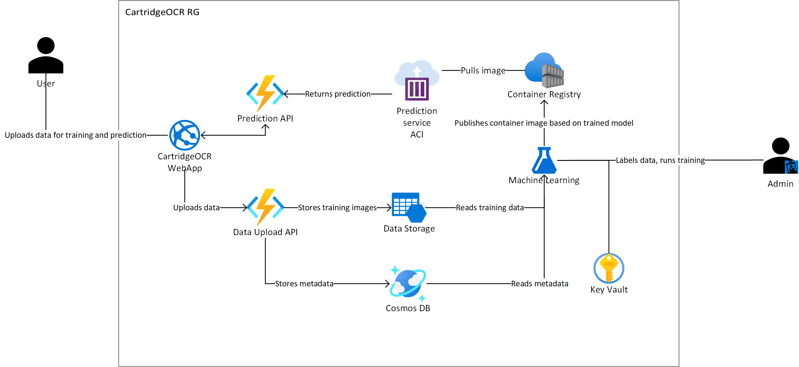

# CartridgeOCR

src folder contains the training code based on the AML annotations.

h4g deck is [here](https://1drv.ms/p/s!Aq_TlvfieKvqu8t5DYBMbiD91PxE6Q?e=STaglB)

## Usage

### Local training on Windows (requires local dataset)

- Install anaconda or miniconda
- Install VS C++ build tools from https://visualstudio.microsoft.com/visual-cpp-build-tools/ (choose the Visual C++ Desktop development option. Note it's a large download)
- conda create -n t4t python==3.8
- activate t4t
- cd src
- pip install -r requirements.txt
- python training/train.py

You might alo need the Workspace configuration. You can find it by going to the Machine Learning workspace in Azure Portal, then in the overview it's next to the delete button as `Download config.json`. Ask a teammate for a copy of this if you don't have access in Azure.

### Outputs

- data/run_data: output folder
- loss.txt: training loss
- p_[epoch]_[imageid].png: prediction overlays on image
- predictions_[epoch].txt: json dumps of raw predictions
- model_[epoch].pth: model snapshots per epoch. Pytorch format, containing {'model':model, 'optimizer': optimizer, 'lr_scheduler':lr_scheduler, 'epoch':epoch}
- checkpoint.pth: last model snapshot.

### Data prep

If you export a dataset from AML, some conversion is needed- see convert_coco_urls.py

## Roadmap

Some areas to explore:

- CNN training from a few examples.  We have several options for fine-tuning: yolo, aml resnets, torchvision
- given an extraction, unroll it to optimize OCR.
- other enhancements to improve OCR
- labeling and storage workspaces
- mobile app workflow

## Base Architecture

The following architecture diagram shows the major CartridgeOCR components from a Azure resource and network perspective.



## Deployment

### Clone the repository

Clone the repository to your local machine (`git clone https://github.com/Tech4Tracing/CartridgeOCR.git`)

### Pre-requisites

You will require the following pre-requisites installed.

- Terraform >= v0.15.3. The following instructions use local terraform state, you may want to consider [storing you state remotely in Azure](https://docs.microsoft.com/en-us/azure/developer/terraform/store-state-in-azure-storage)
- Azure CLI >= 2.21.0
- An Azure Subscription

### Configuring variables

The environment is going to be provisioned using Terraform scripts. In order to run Terraform, you need to set the environment variables in [/terraform/terraform.tfvars.tmpl](terraform/terraform.tfvars.tmpl).

Rename the `terraform.tfvars.tmpl` to `terraform.tfvars`

Edit the terraform.tfvars as required. As `resource_name_prefix` and `environment` are used in Azure resource names they must be alpha numeric `(a-z,0-9)`. The defaults are as follows:

```hcl
resource_name_prefix     = "cartridgeocr"
environment              = "dev"
location                 = "westeurope"
```

Notice that some resources require a globally unique name, so make sure that resource name prefix makes the generated resource name unique.

### Log into your Azure subscription

[Login and select the azure subscription you wish to deploy to](https://docs.microsoft.com/en-us/azure/developer/terraform/get-started-cloud-shell#set-the-current-azure-subscription):

```cmd
az login
az account set -s <subscription_name_or_id>
```

### Run the deployment script

A [deployment script](./deploy.sh) automates the deployment process. Run the script to deploy resources to Azure as well as any code.
The script will:

- Install zip and jq that are used by the script to package files and parse JSON
- Execute `terraform apply` provisioning all resources in Azure
- Generate local.settings file used by API Azure function for local debugging
- Deploy API Azure Function
- Set configuration values to the API Azure function
- Deploy Ionic static web app

You may wish to grant an exception to the webapp folder in Defender settings- running a build churns the malware scanner.

### Testing the image upload API

To test the image upload API you can submit an upload request with curl. Replace the myImage.jpg with an image file that you want to upload, and change the URL to the one that has been outputted by the deployment script.

```cmd
(echo -n '{"filename": "myImage.jpg","filetype":"image/jpeg","data": "'; base64 myImage.jpg; echo '"}') |
 curl -H "Content-Type: application/json" -d @-  https://api-cartridgeocr-dev.azurewebsites.net/api/image-upload
```

### Uploading data files to Azure

If you have a data (image) and label datasets that you would like to upload to Azure Storage for training, you can use the [upload.sh](./data/upload.sh) script after running the deployment script. Script will use the .env file to connect to the right storage account and look for images and labels folders to upload image and label datasets respectively.

### Running training in Azure

To run the training on the AML cluster provisioned in the deployment script, you can run [run_training.py](./src/AML/run_training.py) from the src folder. Notice that to run training in AML you don't have to run the full requirements.txt file locally, but you would need to pip install azure-ml and azure-ml-core.

```cmd
pip install azureml-core
python ./AML/run_training.py
```

## The following instructions may be deprecated...

## Dev environment

[https://pytorch.org/tutorials/intermediate/torchvision_tutorial.html](https://pytorch.org/tutorials/intermediate/torchvision_tutorial.html)

- conda install cython
- conda install jupyter
- pip install opencv
- pip install [git+https://github.com/gautamchitnis/cocoapi.git@cocodataset-master#subdirectory=PythonAPI](git+https://github.com/gautamchitnis/cocoapi.git@cocodataset-master#subdirectory=PythonAPI)
- pip install pillow
- conda install matplotlib
- pip install azureml-sdk
- pip install azure.cli.core
- pip install azureml-contrib-dataset

## Explore yolo

- wget [https://pjreddie.com/media/files/yolov3.weights](https://pjreddie.com/media/files/yolov3.weights)

## Explore torchvision

- potentially important: [https://github.com/pytorch/vision/issues/2720](https://github.com/pytorch/vision/issues/2720)

Torchvision todo:

- move to a GPU box.
- double check batch size, epoch size
- visualize outputs
- understand evaluation outputs.
